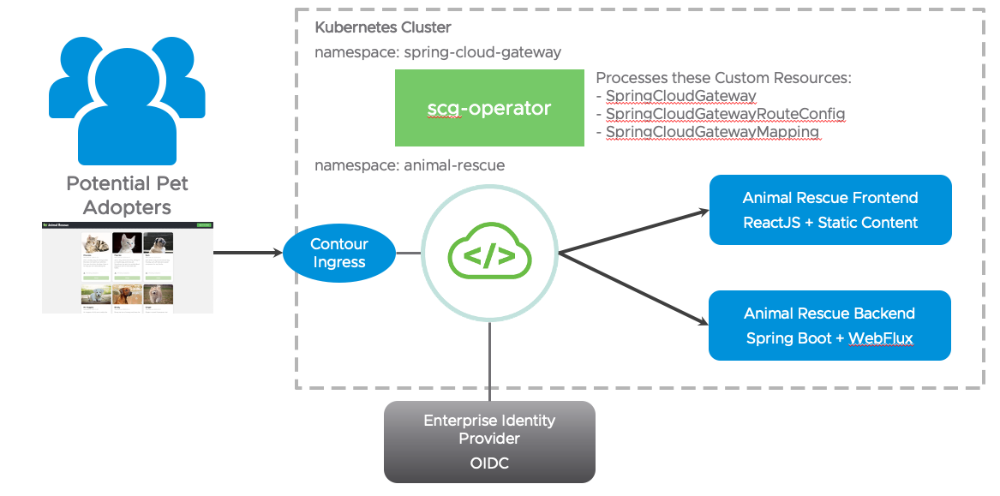
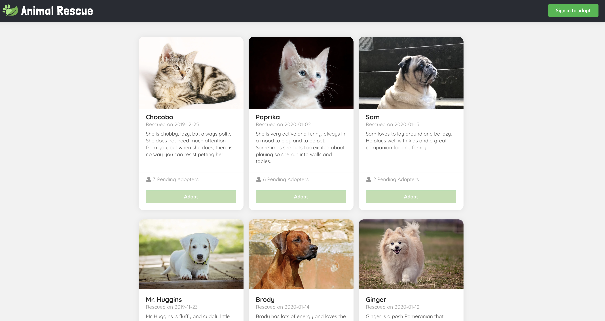
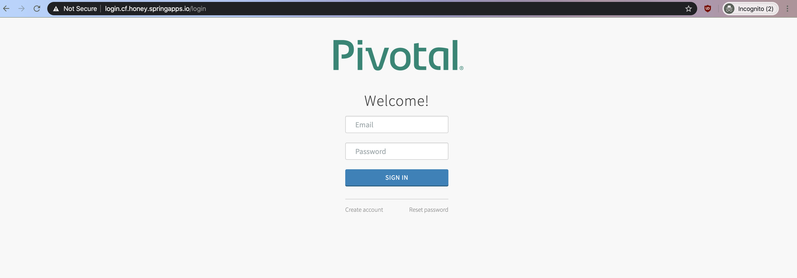
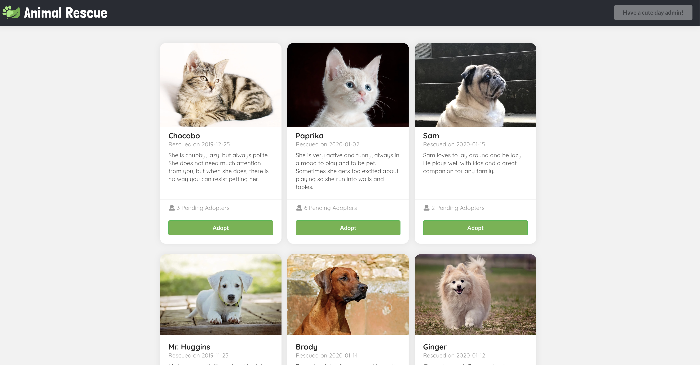
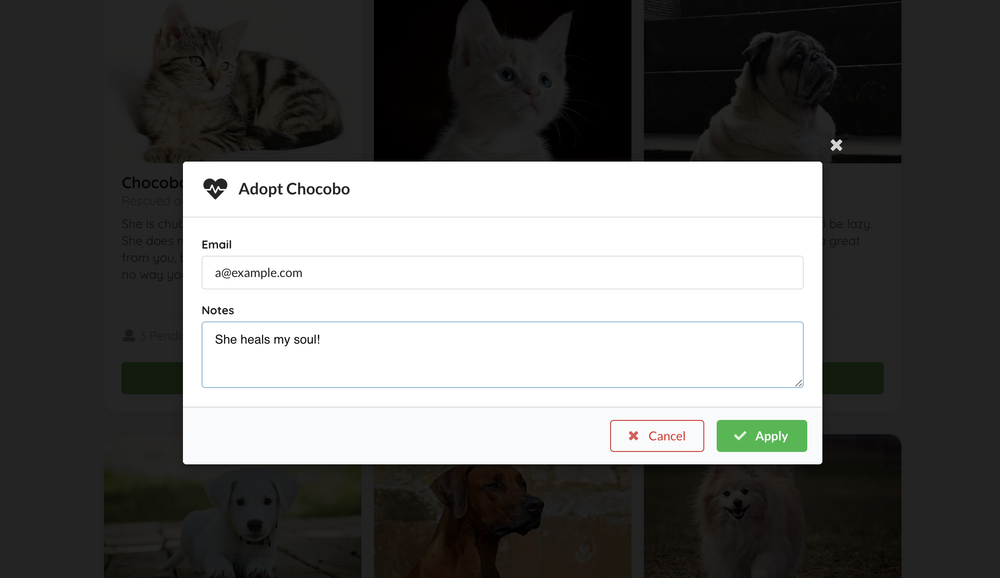
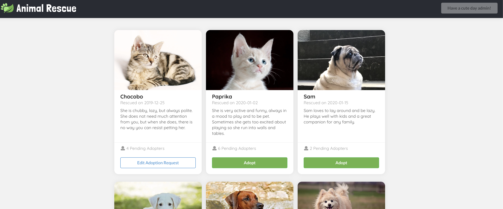
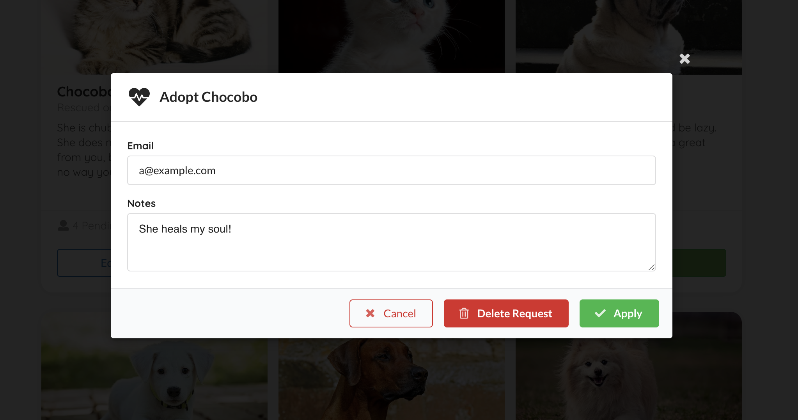

# Animal Rescue
[](https://github.com/AndriyKalashnykov/animal-rescue/actions/workflows/main.yml)

Sample app for VMware Tanzu products. Features we demonstrate with this sample app:




## Table of Contents

* [Gateway and Animal Rescue application features](#gateway-and-animal-rescue-application-features)
* [Development](#development)

## Gateway and Animal Rescue application features

Visit `https://localhost:3000/rescue`, you should see cute animal bios with the `Adopt` buttons disabled. All the information are fetched from a public `GET` backend endpoint `/animals`.



Click the `Sign in to adopt` button on the top right corner, you should be redirected to the SSO login page if you haven't already logged in to SSO.
There are two test accounts - `alice / test` and `bob / test`.



Once you logged in, you should see a greeting message regarding the username you log in with on the top right corner, and the `Adopt` buttons should be enabled.



Click on the `Adopt` button, input your contact email and application notes in the model, then click `Apply`, a `POST` request should be sent to a `sso-enabled` backend endpoint `/animals/{id}/adoption-requests`, with the adopter set to your username we parsed from your token.

   

Then the model should close, and you should see the `Adopt` button you clicked just now has turned into `Edit Adoption Request`. This is matched by your SSO log in username.

   

Click on the `Edit Adoption Request` again, you can view, edit (`PUT`), and delete (`DELETE`) the existing request.

   

## Development

### Run locally

Use the following commands to manage the local lifecycle of animal-rescue:

```bash
./scripts/local.sh start         # start auth server, frontend app, and backend app
./scripts/local.sh start --quiet # start everything without launching the app in browser, and redirects all output to `./scripts/out/`
./scripts/local.sh stop          # stop auth server, frontend app, and backend app. You would only need to do this if you start the app in quiet mode.
```

### Tests

Execute the following script to run all tests:

```bash
./scripts/local.sh init          # install dependencies for the frontend folder and the e2e folder
./scripts/local.sh ci            # run backend tests and e2e tests
./scripts/local.sh backend       # run backend test only
./scripts/local.sh e2e --quiet   # run e2e test only without interactive mode
```

You can find an e2e test output video showing the whole journey in `./e2e/cypress/videos/` after the test run. If you would like to launch the test in an actual browser and run e2e test interactively, you may run the following commands:

```bash
./scripts/local.sh start
./scripts/local.sh e2e
```

More detail about the e2e testing framework can be found at [Cypress API documentation](https://docs.cypress.io/api/api/table-of-contents.html) 

### CI

#### GitHub Actions

GitHub Actions run all checks for the `main` branch and all PR requests. All workflow configuration can be found in [`.github/workflows/main.yml`](https://github.com/AndriyKalashnykov/animal-rescue/blob/6741f90a579f331dbc3153ab6c56d8b684d5a05f/.github/workflows/main.yml)

### Mainteiners

[Andriy Kalashnykov](https://github.com/AndriyKalashnykov)