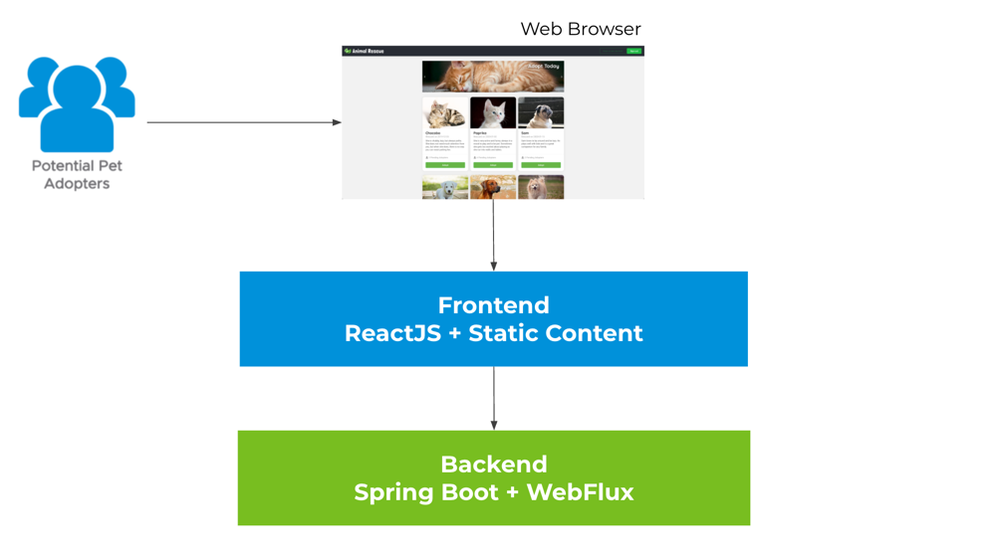

# Animal Rescue
[](https://github.com/AndriyKalashnykov/animal-rescue/actions/workflows/main.yml)

Sample app to demonstrate VMware opinionated way to build impactful applications by leveraging Tanzu products.

Features we demonstrate with this sample app:

* VMware Tanzu Observability - [Wavefront for Spring Boot](https://docs.wavefront.com/wavefront_springboot.html#step-3--view-your-data-on-wavefront)
* Front end testing for the modern web - [Cypress](https://docs.cypress.io/guides/overview/why-cypress)



## Table of Contents

* [Animal Rescue application features](#animal-rescue-application-features)
* [Development](#development)

## Animal Rescue application features

Visit `https://localhost:3000/rescue`, you should see cute animal bios with the `Adopt` buttons disabled. All the information are fetched from a public `GET` backend endpoint `/animals`.


Click the `Sign in to adopt` button on the top right corner, you should be redirected to the SSO login page if you haven't already logged in to SSO.
There are two test accounts - `alice / test` and `bob / test`.


Once you logged in, you should see a greeting message regarding the username you log in with on the top right corner, and the `Adopt` buttons should be enabled.


Click on the `Adopt` button, input your contact email and application notes in the model, then click `Apply`, a `POST` request should be sent to a `sso-enabled` backend endpoint `/animals/{id}/adoption-requests`, with the adopter set to your username we parsed from your token.

   

Then the model should close, and you should see the `Adopt` button you clicked just now has turned into `Edit Adoption Request`. This is matched by your SSO log in username.

   

Click on the `Edit Adoption Request` again, you can view, edit (`PUT`), and delete (`DELETE`) the existing request.

   

## Development

## Pre-requisites

- [sdkman](https://sdkman.io/install)

    Install and use JDK 11

    ```bash
    sdk install 11.0.11.hs-adpt
    sdk use 11.0.11.hs-adpt
    ```

## Configure VMware Tanzu Observability (Wavefront)

Wavefront for Spring Boot allows you to quickly configure your
environment, so Spring Boot components send metrics, histograms,
and traces/spans to the Wavefront service, for more details see
how to [examine Spring Boot data in Wavefront dashboards and charts](https://docs.wavefront.com/wavefront_springboot.html#prerequisites-for-wavefront-spring-boot-starter)

### Sending Data From Spring Boot Into Wavefront

You can send data from your Spring Boot applications into Wavefront using the Wavefront for Spring Boot Starter 
(all users) or the Wavefront Spring Boot integration (Wavefront customers and trial users).

* **Freemium** :  All users can run the Spring Boot Starter with the default settings to view their data in the Wavefront Freemium instance. Certain limitations apply, for example, alerts are not available, but you don’t have to sign up.
* **Wavefront Customer or Trial User** : Wavefront customers or trial users can modify the default Wavefront Spring Boot Starter to send data to their cluster. [You can sign up for a free 30-day trial here](https://tanzu.vmware.com/observability)

#### Sending Data From Spring Boot Into Wavefront - Freemium

To configure `Freeminum` modify `application.yml`
by specifying `freemium-account : true`, setting `name` of the overarching application and current `service` name in particular.

```yaml
wavefront:
  freemium-account: true
  application:
    name: spring-on-k8s
    service: backend
```

#### Sending Data From Spring Boot Into Wavefront - Wavefront Customer or Trial User

To configure `Wavefront Customer or Trial User` modify `application.yml`
by specifying `freemium-account : false` and providing `uri` and `api-token` of the Wavefront instance.

```yaml
wavefront:
  freemium-account: false
  application:
    name: spring-on-k8s
    service: backend

management:
  metrics:
    export:
      wavefront:
        api-token: "$API_Token"
        uri: "$wavefront_instance"
```

We also need to configure Wavefront dependencies based on how you want to send data to Wavefront. Two options are available 
`Spring Cloud Sleuth` and `OpenTracing`.

#### Sending data to `Wavefront` with `Spring Cloud Sleuth`

Use Gradle project file [`to-sleuth.gradle`](https://github.com/AndriyKalashnykov/animal-rescue/blob/ecd35866f819307c572c15c87641a803b6efe1ca/backend/to-sleuth.gradle)

```json
dependencyManagement {
    imports {
        // wavefront
        mavenBom "com.wavefront:wavefront-spring-boot-bom:2.2.0"

        // sleuth
        mavenBom "org.springframework.cloud:spring-cloud-dependencies:2020.0.4"
    }
}

dependencies {
    // wavefront
    implementation 'com.wavefront:wavefront-spring-boot-starter'

    // sleuth
    implementation 'org.springframework.cloud:spring-cloud-starter-sleuth'
}
```

#### Sending data to `Wavefront` with `OpenTracing`

Modfy Gradle project file [`to-opentracing.gradle`](https://github.com/AndriyKalashnykov/animal-rescue/blob/ecd35866f819307c572c15c87641a803b6efe1ca/backend/to-opentracing.gradle)

```json
// https://docs.wavefront.com/wavefront_springboot.html

dependencyManagement {
    imports {
        // wavefront
        mavenBom "com.wavefront:wavefront-spring-boot-bom:2.2.0"
    }
}

dependencies {
    // wavefront
    implementation 'com.wavefront:wavefront-spring-boot-starter'

    // OpenTracing
    // https://mvnrepository.com/artifact/io.opentracing.contrib/opentracing-spring-cloud-starter
     implementation 'io.opentracing.contrib:opentracing-spring-cloud-starter:0.5.9'
}
```

Now you can run the project and observe link to the Wavefront dashboard:

```bash
$ sdk use 11.0.11.hs-adpt
Using java version 11.0.11.hs-adpt in this shell.

$ ./gradlew :backend:bootRun -x test -Pto-sleuth --args='--spring.profiles.active=to-sleuth'

> Task :backend:bootRun

  .   ____          _            __ _ _
 /\\ / ___'_ __ _ _(_)_ __  __ _ \ \ \ \
( ( )\___ | '_ | '_| | '_ \/ _` | \ \ \ \
 \\/  ___)| |_)| | | | | || (_| |  ) ) ) )
  '  |____| .__|_| |_|_| |_\__, | / / / /
 =========|_|==============|___/=/_/_/_/
 :: Spring Boot ::                (v2.5.5)

2022-01-22 Sat 00:22:26.719 [traceid= spanid= parentspanid=] INFO  20699 [restartedMain] io.spring.cloud.samples.animalrescue.backend.AnimalRescueBackendApplication:55 : Starting AnimalRescueBackendApplication using Java 17.0.1 on akalashnyko-a02.vmware.com with PID 20699 (/Users/akalashnykov/projects/animal-rescue/backend/build/classes/java/main started by akalashnykov in /Users/akalashnykov/projects/animal-rescue/backend)
2022-01-22 Sat 00:22:26.721 [traceid= spanid= parentspanid=] INFO  20699 [restartedMain] io.spring.cloud.samples.animalrescue.backend.AnimalRescueBackendApplication:663 : The following profiles are active: to-sleuth
2022-01-22 Sat 00:22:26.755 [traceid= spanid= parentspanid=] INFO  20699 [restartedMain] org.springframework.boot.devtools.env.DevToolsPropertyDefaultsPostProcessor:255 : Devtools property defaults active! Set 'spring.devtools.add-properties' to 'false' to disable
2022-01-22 Sat 00:22:26.755 [traceid= spanid= parentspanid=] INFO  20699 [restartedMain] org.springframework.boot.devtools.env.DevToolsPropertyDefaultsPostProcessor:255 : For additional web related logging consider setting the 'logging.level.web' property to 'DEBUG'
2022-01-22 Sat 00:22:27.502 [traceid= spanid= parentspanid=] INFO  20699 [restartedMain] org.springframework.data.repository.config.RepositoryConfigurationDelegate:132 : Bootstrapping Spring Data R2DBC repositories in DEFAULT mode.
2022-01-22 Sat 00:22:27.636 [traceid= spanid= parentspanid=] INFO  20699 [restartedMain] org.springframework.data.repository.config.RepositoryConfigurationDelegate:201 : Finished Spring Data repository scanning in 130 ms. Found 2 R2DBC repository interfaces.
2022-01-22 Sat 00:22:27.841 [traceid= spanid= parentspanid=] INFO  20699 [restartedMain] org.springframework.cloud.context.scope.GenericScope:283 : BeanFactory id=d7d6d0bd-0b94-3206-b104-c63984c3568e
2022-01-22 Sat 00:22:28.556 [traceid= spanid= parentspanid=] INFO  20699 [restartedMain] org.springframework.boot.devtools.autoconfigure.OptionalLiveReloadServer:58 : LiveReload server is running on port 35729
2022-01-22 Sat 00:22:28.887 [traceid= spanid= parentspanid=] INFO  20699 [restartedMain] io.spring.cloud.samples.animalrescue.backend.SecurityConfiguration:45 : frontendURI: http://localhost:3000/rescue
2022-01-22 Sat 00:22:29.279 [traceid= spanid= parentspanid=] INFO  20699 [restartedMain] io.micrometer.core.instrument.push.PushMeterRegistry:71 : publishing metrics for WavefrontMeterRegistry every 1m
2022-01-22 Sat 00:22:29.372 [traceid= spanid= parentspanid=] INFO  20699 [restartedMain] org.springframework.boot.actuate.endpoint.web.EndpointLinksResolver:58 : Exposing 15 endpoint(s) beneath base path '/actuator'
2022-01-22 Sat 00:22:30.172 [traceid= spanid= parentspanid=] INFO  20699 [restartedMain] org.springframework.boot.web.embedded.netty.NettyWebServer:111 : Netty started on port 8080
2022-01-22 Sat 00:22:30.196 [traceid= spanid= parentspanid=] INFO  20699 [restartedMain] io.spring.cloud.samples.animalrescue.backend.AnimalRescueBackendApplication:61 : Started AnimalRescueBackendApplication in 4.697 seconds (JVM running for 5.115)

Your existing Wavefront account information has been restored from disk.

To share this account, make sure the following is added to your configuration:

        management.metrics.export.wavefront.api-token=dc9addea-8bae-467e-8f04-6b5dcfad1527
        management.metrics.export.wavefront.uri=https://wavefront.surf

Connect to your Wavefront dashboard using this one-time use link:
https://wavefront.surf/us/XZnJssKH49
```

Click on Wavefront dashboard link [https://wavefront.surf/us/XZnJssKH49](https://wavefront.surf/us/XZnJssKH49) and navigate to `Dashboards -> Spring Boot`


you may also want to check `Applications -> Traces`


### Run locally

Use the following commands to manage the local lifecycle of animal-rescue:

```bash
sdk use 11.0.11.hs-adpt
./scripts/local.sh start         # start auth server, frontend app, and backend app
./scripts/local.sh start --quiet # start everything without launching the app in browser, and redirects all output to `./scripts/out/`
./scripts/local.sh stop          # stop auth server, frontend app, and backend app. You would only need to do this if you start the app in quiet mode.
```

### Tests

Execute the following script to run all tests:

```bash
sdk use 11.0.11.hs-adpt
./scripts/local.sh init          # install dependencies for the frontend folder and the e2e folder
./scripts/local.sh ci            # run backend tests and e2e tests
./scripts/local.sh backend       # run backend test only
./scripts/local.sh e2e --quiet   # run e2e test only without interactive mode
```

You can find an e2e test output video showing the whole journey in `./e2e/cypress/videos/` after the test run. If you would like to launch the test in an actual browser and run e2e test interactively, you may run the following commands:

```bash
sdk use 11.0.11.hs-adpt
./scripts/local.sh start
./scripts/local.sh e2e
```

More detail about the e2e testing framework can be found at [Cypress API documentation](https://docs.cypress.io/api/api/table-of-contents.html) 

### CI

#### GitHub Actions

GitHub Actions run all checks for the `main` branch and all PR requests. All workflow configuration can be found in [`.github/workflows/main.yml`](https://github.com/AndriyKalashnykov/animal-rescue/blob/6741f90a579f331dbc3153ab6c56d8b684d5a05f/.github/workflows/main.yml)

### Mainteiners

[Andriy Kalashnykov](https://github.com/AndriyKalashnykov)